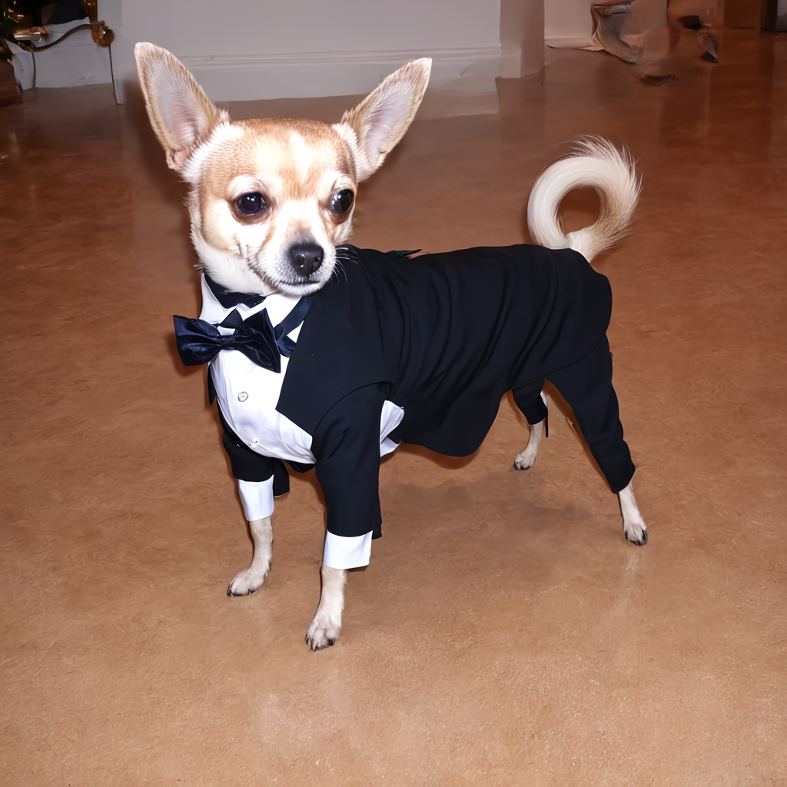
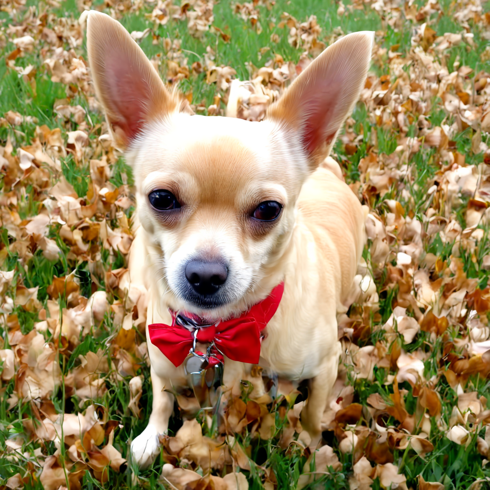
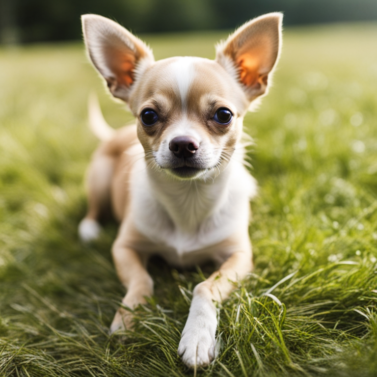
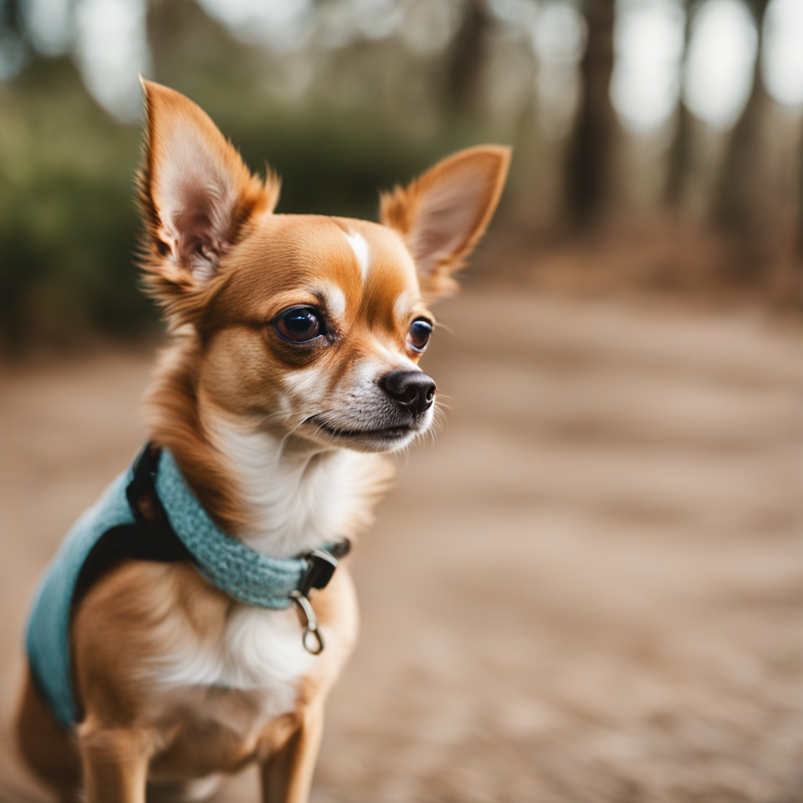
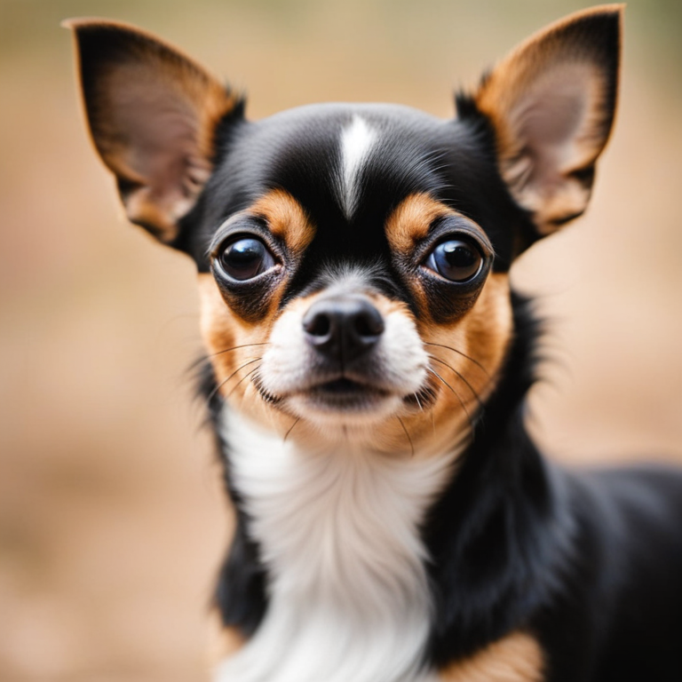

# SDXL-chihuahua-LoRA

My cog deployment of a stable-diffusion-xl-base-1.0 Lora finetuned on chihuahua's  https://huggingface.co/GDavila/SDXL-chihuahua-LoRA 

Why? - Base SDXL is very hit-or-miss with dogs

# Comparison
tested this lora against base sdxl with same prompt "A photo of a chihuahua" and negative prompt "cartoon, 3d, ((disfigured)), ((bad art)), ((deformed)),((extra limbs)),((close up)),((b&w)), wierd colors, blurry, (((duplicate))), ((morbid)), ((mutilated)), [out of frame], extra fingers, mutated hands, ((poorly drawn hands)), ((poorly drawn face)), (((mutation))), (((deformed))), ((ugly)), blurry, ((bad anatomy)), (((bad proportions))), ((extra limbs)), cloned face, (((disfigured))), out of frame, ugly, extra limbs, (bad anatomy), gross proportions, (malformed limbs), ((missing arms)), ((missing legs)), (((extra arms))), (((extra legs))), mutated hands, (fused fingers), (too many fingers), (((long neck))), Photoshop, video game, ugly, tiling, poorly drawn hands, poorly drawn feet, poorly drawn face, out of frame, mutation, mutated, extra limbs, extra legs, extra arms, disfigured, deformed, cross-eye, body out of frame, blurry, bad art, bad anatomy, 3d render"

## Lora

some artifacts but overall a more real photo (sans the tuxedo prompt used above)

## Base SDXL
Often look somewhat "ethereal" for lack of a better word. Look at the fur on top of the head. Looks like someone applied a doggy face filter to them, just looks too off. 

